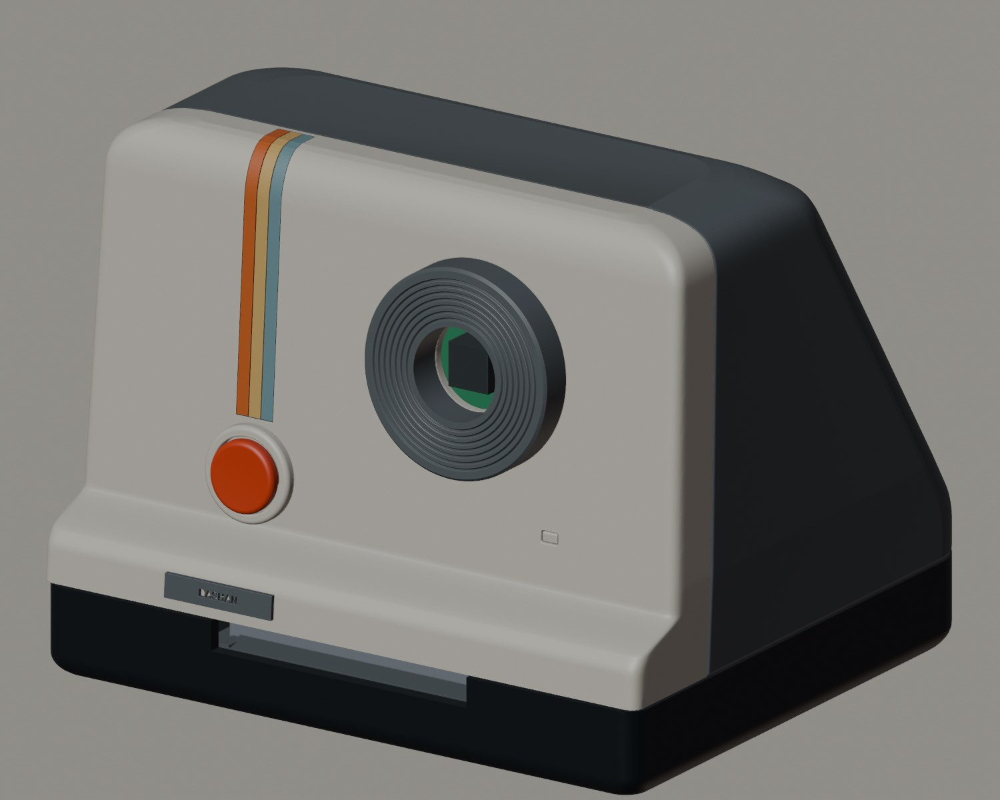

# 侦探相机 · Detective Camera

**把一张日常照片，变成一份可以带走的微型案卷。**

侦探相机是一台结合 AI、实体交互与数字制造的创作相机。按下快门后，它观察照片中的物件与细节，以真实可见的线索为起点，虚构一桩离奇、有趣、但符合现实因果的微型案件，再通过屏幕表情、侦探式语音和热敏打印，把这次观察变成一份纸质报告。

它不是用来判断现实真相的侦查设备，而是一个让人重新注意日常、参与叙事的创作搭档：一个杯子、一件衣服、一张工作台，都可能成为故事的开始。

> 当前是参赛与开源准备版，GitHub 仓库仍为私有。自有代码采用 MIT，外壳设计和原创文档采用 CC BY 4.0；第三方组件与未确认授权素材另行管理。此状态不代表已公开发布，也不代表符合某个比赛尚未提供的全部规则。



## 为什么做它

许多 AI 体验停留在输入框与屏幕里。我们想把它变成一个真实的小物件：能拿在手里、能表达反应，也能吐出一份纸质结果。让照片不只是被识别，而是成为一次有角色、有悬念、有反馈的互动。

创作者决定体验、硬件结构与叙事尺度，AI 辅助代码编写和方案迭代。项目关注的不是训练一个新的基础模型，而是如何把现成的模型能力、硬件和人的创意组织成完整体验。

## 一次使用会发生什么

1. **观察**：按下快门，拍摄眼前场景，记录物件、位置和状态。
2. **思考**：等待分析时，屏幕出现侦探表情，本地语音以观察和思考的口吻回应。
3. **推理**：以照片事实为依据设定案件，用一致的目标、行动和结果还原故事。
4. **出卷**：将照片、线索与推测打印成案卷；可选语音讲述同一个案件。

示例「衣服真正的主人」：肩膀上的两个鼓包对应衣架两端，侦探却推测衣架才是衣服的主人，拍照的人反而成了“嫌疑人”。这是幽默叙事，不是对现实人物的指控。完整示例见 [参赛项目说明](competition/PROJECT_BRIEF.md)。

## 项目特色

- **照片事实与虚构故事分离**：先记录可见线索，再组织案情；不把虚构身份、动机说成已证实的事实。
- **把等待设计成表演**：语音、表情与打印状态配合，让分析延迟成为角色思考的一部分，而不是静止的加载页。
- **实体结果可以带走**：384 点热敏案卷把交互从屏幕延伸到纸上。
- **为复现和改造提供材料**：提供设备源码、后端、提示词、测试、网页演示和 V33 可编辑外壳/27 个 STL；完整的空白环境构建与实物复现验收仍待完成。

## 系统组成

ESP32-S3 负责拍照、快门、屏幕、语音播放和打印；Python 后端负责模型调用、结果校验、任务队列、票面与可选 TTS。模型输出文字/JSON，票面图片来自实拍照片的黑白处理，不是 AI 生成图片。

网页演示使用固定示例，**不连接实机、不拍照、不上传照片、不实时调用模型**。诗歌/文学匹配保留为附属功能，侦探相机是主线。

| 目录 | 内容 |
| --- | --- |
| `competition/` | 项目简介、参赛展示脚本与证据清单 |
| `firmware/` | ESP32-S3 相机、快门、显示、音频、打印与配网源码 |
| `backend/` | 导演台、模型配置、案件生成/校验、渲染与测试 |
| `hardware/` | V33 装配、27 个 STL、结构预览与设计核验 |
| `demo/` | 三维交互、固件动画和固定案卷演示 |
| `voice_pack_12/` | 私有试验语音归档；不属于公开分发素材 |
| `docs/`、`tools/` | 接线、恢复、安全、授权、公开前检查与备份工具 |

## 快速体验

无需设备或 API Key，可先启动固定案卷演示：

```sh
cd demo
npm ci
node build.mjs
python3 -m http.server 8894 --bind 127.0.0.1
```

打开 `http://127.0.0.1:8894/`。当前私有演示含历史配音；以后公开时必须先替换成原创/明确授权的声音，或提供无声音版本。

## 启动导演台

```sh
python3 -m venv .venv
. .venv/bin/activate
pip install -r requirements.txt
cp backend/.env.example backend/.env
```

在 `.env` 中填写各自独立的设备令牌、管理员密码和模型配置，再运行：

```sh
cd backend
DASHAN_HOST=127.0.0.1 python3 server.py
```

打开 `http://127.0.0.1:8787/director`，用户名 `admin`，密码由 `DASHAN_ADMIN_TOKEN` 设置。首次使用请选择侦探模式。真实照片处理需要支持当前请求格式的模型服务和用户自己的凭据；外部服务的费用、延迟与可用性不由项目保证。

设备使用 Arduino ESP32 Core 3.3.7 / ESP32-audioI2S 3.4.7，16 MB Flash、8 MB OPI PSRAM。接线与编译见 [硬件说明](docs/HARDWARE.md) 和 [固件说明](firmware/README.md)。历史工程名 `PoetryCameraDirector` 保留，避免破坏 Arduino 工程兼容。

## 验证与当前边界

```sh
cd backend
python3 -m unittest -v test_server.py test_detective.py test_detective_renderer.py test_case_voice.py
```

2026-10-04 已通过 48 项后端测试、网页交互检查及 V33 归档模型一致性检查，详见 [验证记录](docs/BACKUP_2026-10-04.md)。这些测试不等于完整硬件认证：最终螺丝规格、触摸交互和完整复现仍需实物验收；打印“完成”表示数据发送完成，不是传感器确认纸已出来。AI 仍可能识别或叙事出错，不用于执法、身份判断或其他现实决策。

## 授权、隐私与参与

- [授权范围与第三方声明](NOTICE.md)：MIT / CC BY 4.0 不覆盖第三方字体、库、现有 MP3 或授权尚待核实内容。
- [公开前清单](docs/RELEASE_CHECKLIST.md)：公开包必须从干净文件清单导出，不能直接把含历史配音的私有仓库改为 public。
- [隐私边界](docs/PRIVACY.md)、[安全说明](SECURITY.md)：不提交 Key、设备配置、实拍照片或聊天记录。
- [贡献指南](CONTRIBUTING.md)、[恢复与隔离部署](docs/RESTORE.md)：先运行本地检查，不自动刷写设备或变更在线服务器。

维护署名：DASHAN / `dashan914`。欢迎未来围绕原创角色、可复现硬件、故事质量与无障碍体验继续改造；目前先在私有仓库完成参赛准备。
